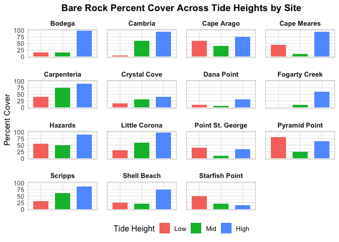

# Factor_Homework
Zoe Sidana Bunnath

## Introduction

For this homework, I worked with the intertidal dataset to explore how
percent cover changes across different tide heights. The dataset
includes observations from multiple sites, with several transects and
quadrats placed in the low, mid, and high tide zones. Each quadrat
records the percent cover of different substrates and species, such as
bare rock, algae, mussels, and barnacles.

I started by cleaning the data to make the column names consistent and
to fix small issues in the quadrat labels. I also reshaped the data
using `pivot_longer()` so it would be easier to work with in ggplot.
Then I created a plot that focuses on bare rock cover to see how it
changes by site and tide height. This helps show patterns of species
distribution and exposure in the intertidal zone.

## Load Libraries

``` r
library(tidyverse) # for data wrangling
library(here) # for file path
library(janitor) # for cleaning the column names
```

## Load and Clean Data

``` r
# load intertidal data 
intertidaldata <- read_csv(here("Week_09", "data", "intertidaldata.csv"))

glimpse(intertidaldata) # check the raw data 
```

    Rows: 450
    Columns: 13
    $ Site                  <chr> "Scripps", "Scripps", "Scripps", "Scripps", "Scr…
    $ Transect              <dbl> 1, 1, 1, 2, 2, 2, 3, 3, 3, 4, 4, 4, 5, 5, 5, 6, …
    $ Quadrat               <chr> "Low  .", "Mid", "High", "Low", "Mid", "High", "…
    $ `Bare Rock`           <dbl> 25, 50, 20, 10, 40, 40, 0, 30, 60, 0, 45, 70, 5,…
    $ Algae                 <dbl> 75, 0, 50, 85, 5, 5, 100, 5, 4, 100, 10, 0, 70, …
    $ Mussels               <dbl> 0, 5, 1, 0, 10, 0, 0, 10, 1, 0, 3, 0, 0, 5, 0, 0…
    $ `Small Barnacles`     <dbl> 2, 50, 50, 0, 40, 55, 0, 40, 20, 0, 25, 25, 20, …
    $ `Large Barnacles`     <dbl> 5, 5, 0, 0, 1, 0, 1, 0, 0, 0, 15, 5, 5, 0, 0, 5,…
    $ `Gooseneck Barnacles` <dbl> 0, 0, 0, 5, 5, 0, 0, 30, 5, 0, 0, 0, 0, 0, 0, 0,…
    $ Anemone               <dbl> 3, 0, 0, 0, 0, 0, 0, 0, 0, 0, 5, 0, 0, 10, 0, 0,…
    $ `Whelks (Counts)`     <dbl> 0, 0, 0, 0, 0, 0, 0, 0, 1, 0, 0, 0, 0, 1, 0, 0, …
    $ `Crabs (Counts)`      <dbl> 0, 0, 0, 0, 0, 0, 0, 0, 0, 0, 0, 0, 0, 0, 0, 0, …
    $ `Stars (Counts)`      <dbl> 0, 0, 0, 0, 0, 0, 0, 0, 0, 0, 0, 0, 0, 0, 0, 0, …

``` r
# rename the columns names and ensure consistencies in the quadrat data
intertidaldata <- intertidaldata %>%
  clean_names() %>% # clean and standardize all column names
  mutate(
    quadrat = str_replace_all(quadrat, "\\.", ""), # change "Low ." to "Low"
    quadrat = str_replace_all(quadrat, "\\s*1", ""), # change "Mid 1" to "Mid",
     quadrat = str_trim(quadrat), # remove extra spaces,
    quadrat = factor(quadrat, levels = c("Low", "Mid", "High")) # set factor order so tide heights appear from Low to High in plots
 ) %>%
  
#reshape data from wide to long format so each cover type becomes a row for easier plotting
   pivot_longer (
  cols = c(bare_rock, algae, mussels, small_barnacles, large_barnacles, gooseneck_barnacles, anemone),
  names_to = "cover",
  values_to = "percent_cover"
) 

view(intertidaldata) # check the cleaned data
```

## Visualize Data

``` r
# Bare Rock Percent Cover Across Tide Heights by Site
intertidaldata %>%
  filter(cover == "bare_rock") %>%  # keep only bare rock
  ggplot(aes(x = quadrat, y = percent_cover, fill = quadrat)) +
  geom_col(position = "dodge", width = 0.7) +  # bar chart
  facet_wrap(~ site) +  # separate panels by site
  labs(
    title = "Bare Rock Percent Cover Across Tide Heights by Site",
    x = NULL, # remove x-axis label text
    y = "Percent Cover",
    fill = "Tide Height"  # legend title
  ) +
theme_minimal(base_size = 12) +   # simple, clean theme with slightly larger text
theme(
  axis.text.x = element_blank(),  # remove x-axis labels
  axis.ticks.x = element_blank(), # remove x-axis tick marks
  legend.position = "bottom",     # place legend below the plot
  strip.text = element_text(face = "bold", size = 10),  # make site titles bold and readable
  plot.title = element_text(face = "bold", size = 14, hjust = 0.5), # make title bold, larger, and centered
  panel.border = element_rect(color = "gray70", fill = NA, linewidth = 0.5),  # add light border around each facet
  panel.spacing = unit(1, "lines")  # add space between facet panels
)
```



``` r
ggsave(here("Week_09","Output","Factor_homework.png"))
```
